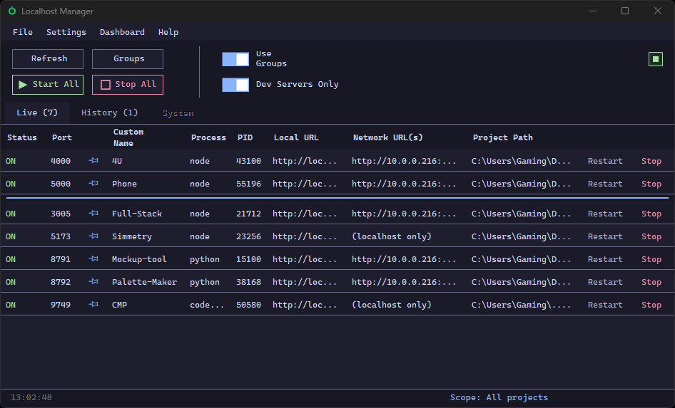

# Localhost Manager

[](../../releases/latest)
[](LICENSE)

A small Windows tray app that scans your machine for running `localhost` dev
servers (npm/node projects), shows their status, LAN URLs, and lets you
start/stop them individually or in named groups — all without a config file.



## Download

Grab the latest `LocalhostManager.exe` from the
[Releases](../../releases) page and run it. No install needed.

## Features

- Auto-detects running npm/node dev servers by port, recovering each
  project's real working directory even when the command line alone
  doesn't show it (e.g. `npm start`)
- **CPU and RAM columns** per running process, right in the grid - see
  which of your dev servers is actually busy without alt-tabbing to Task
  Manager (100% = one full core busy, so a single-threaded server maxing
  its one thread stands out clearly instead of reading as a few percent)
- **Column chooser**: a toolbar icon next to Groups lets you show/hide
  the informational columns (Custom Name, Process, PID, CPU, RAM, Local
  URL, Network URL(s), Project Path) across every tab - CPU is off by
  default since it's usually 0% until something's actually busy
- **Resizable and reorderable columns** - hover the header to see the
  resize dividers, drag a column border to resize it, drag a header to
  move it, on any of the three tables. Both stick across restarts and
  stay in sync across tabs. The Restart and Stop/Start columns stay a
  fixed size at the right edge, since they're click targets rather than
  information to rebalance
- Shows local + LAN URLs so you can share a dev server on your network
- Right-click any row for a compact **Detail** popup — every column's full
  value with a one-click copy button, network addresses broken out one per
  adapter (`Ethernet`, `Tailscale`, `VMware`, ...) and virtual/VM-only
  adapters flagged in purple so you don't mistake one for a real LAN address
- Start/Stop from the grid, the tray icon's right-click menu, or in bulk
  via named **groups** (e.g. "frontend + backend + db"). Group membership
  defaults to Node/dev-server ports; a "Show all listening ports" checkbox
  in **Manage Groups** reveals every open port (Python, Docker, etc.) so
  non-Node processes can be grouped too
- Custom names, root-directory scoping, and a tray icon that turns red
  when something in your tracked set goes down
- Runs from the tray — closing the window just hides it
- **Web dashboard** (new in v1.6, opt-in — off until you enable it from the
  **Dashboard** menu): a browser view of the same table at
  `http://localhost:3199` (port configurable), with click-to-confirm
  Stop/Start/Restart, per-adapter clickable LAN/Tailscale links, and a
  live status pill in the toolbar showing whether it's running
- Single-instance protection — launching the app while it's already
  running just shows a message instead of opening a duplicate window
- **Local Domains** (new in v1.11, opt-in — off until you enable it from
  the **Local Domains** menu): a reverse proxy that gives each running
  project a friendly address, e.g. `http://bodyshop.localhost:2802/`
  instead of a raw port - routed by hostname to whatever port that project
  is actually on. Browser-only (Chrome/Edge/Firefox resolve `*.localhost`
  to loopback themselves; curl/Postman/etc. can't). One-time setup, shown
  in the dialog with a Copy button

## Local Domains

Give each running project a name-based address instead of a raw port -
`http://bodyshop.localhost:2802/` reads better than `http://localhost:5100/`,
and it doesn't change out from under you if the port does. Enable it from
the **Local Domains** menu, pick a port (default `2802`), and toggle it on.

It only works from a browser: Chrome, Edge, and Firefox all resolve any
`*.localhost` address to loopback on their own, without needing a DNS entry
or hosts-file edit - but Windows' own DNS resolver doesn't do that, so
non-browser tools (curl, Postman, one service calling another) can't use
these addresses.

Routing by hostname on one shared port needs a wildcard `HttpListener`
binding, which needs a one-time, per-port permission grant (loopback-only -
no firewall change, nothing reachable from another device):

```powershell
netsh http add urlacl url=http://+:2802/ user=Everyone
```

The Local Domains dialog shows this command (with the port you actually
picked) and a Copy button. Run it once as Administrator, then re-enable
(or restart) Local Domains from the dialog. Once it's running, each
project's address shows up in its row's Detail popup as **Local Domain**,
next to Local URL - and visiting the bare proxy address with no project
name (e.g. `http://localhost:2802/`) lists every currently-running
project's address.

## Web dashboard

Enable it from the **Dashboard** menu — pick a port (default `3199`) and
toggle it on. By default it only binds to `localhost`/`127.0.0.1`, so it's
reachable from this PC even without doing anything else.

To reach it from your **phone or another device on the same LAN**, or over
**Tailscale**, run this once as Administrator, then restart the app:

```powershell
netsh http add urlacl url=http://+:3199/ user=Everyone
New-NetFirewallRule -DisplayName "Localhost Manager Dashboard" -Direction Inbound -Protocol TCP -LocalPort 3199 -Action Allow -Profile Domain,Private
```

`-Profile Domain,Private` matters: the dashboard has no login, so anyone who can
reach the port can Stop/Start/Restart your dev servers. Without it, the rule
defaults to *all* profiles including Public — meaning it'd stay reachable on
open/public Wi-Fi too, not just your home LAN or Tailscale.

Without this one-time step, the LAN/Tailscale addresses will show up in the
dashboard's own address list but nothing will actually be listening there —
connections from another device will just time out. The dashboard page
itself has a "Remote access tips" panel with this same info, plus a note on
using Tailscale subnet routes if you want to reach it from outside your LAN
without installing Tailscale on every device. If your phone still can't
connect after the elevated step, check whether your Wi-Fi has AP/client
isolation enabled (common on guest networks) — that blocks device-to-device
traffic regardless of firewall/port settings.

## Building from source

Requires the [`ps2exe`](https://github.com/MScholtes/PS2EXE) PowerShell
module:

```powershell
Install-Module ps2exe -Scope CurrentUser
Import-Module ps2exe
Invoke-PS2EXE -InputFile LocalhostManager.ps1 -OutputFile LocalhostManager.exe `
  -noConsole -iconFile LocalhostManager.ico -title "Localhost Manager" -x64
```

Keep `LocalhostManager.ico` and `LocalhostManager-alert.ico` next to the
compiled `.exe` — they're loaded at runtime for the window/tray icons.

`-x64` is required: the app reads a target process's PEB directly
(`Get-ProcessWorkingDirectory`) to recover its working directory, and a
32-bit build cannot read the memory of 64-bit processes like `node.exe`.
Without `-x64`, every Node/npm dev server silently fails working-directory
detection and gets filtered out by the "Node/npm projects only" checkbox.

## Changelog

See [CHANGELOG.md](CHANGELOG.md) for release history, or the
[Releases](../../releases) page for downloadable builds.

## License

[MIT](LICENSE)
